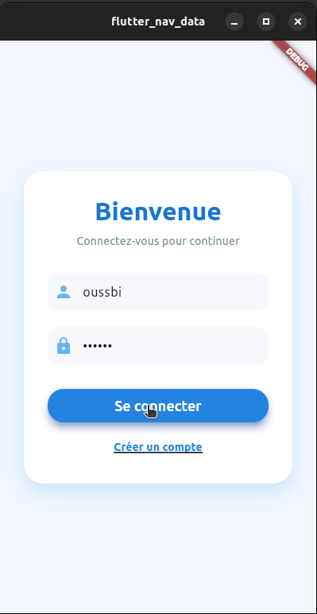
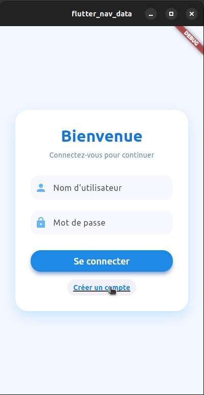
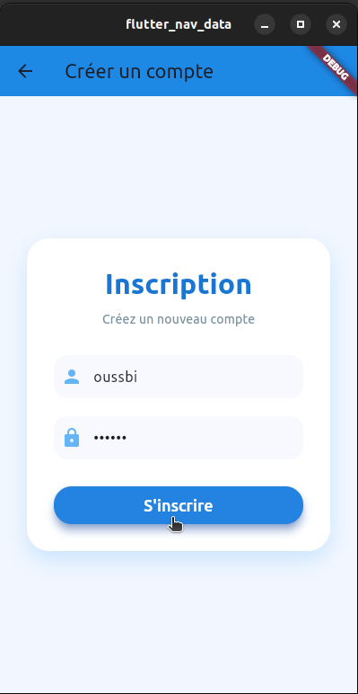
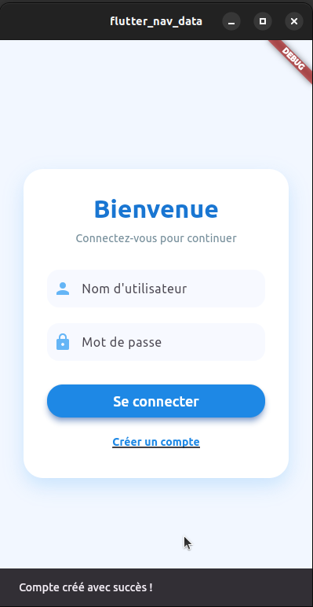
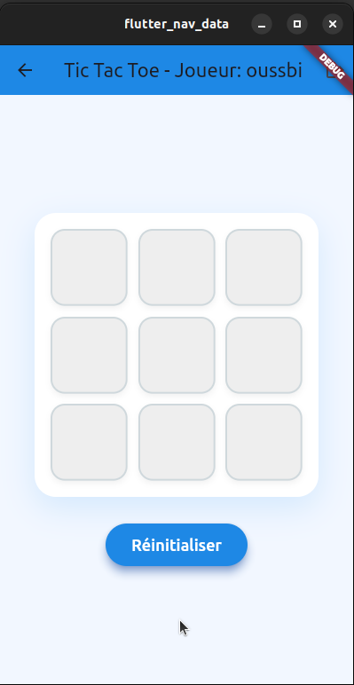
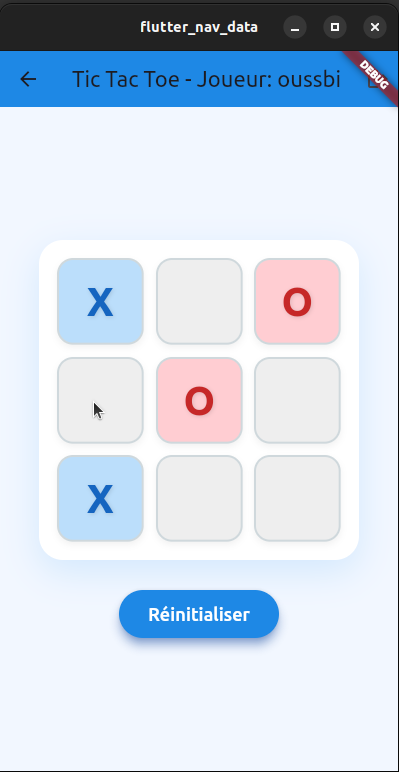
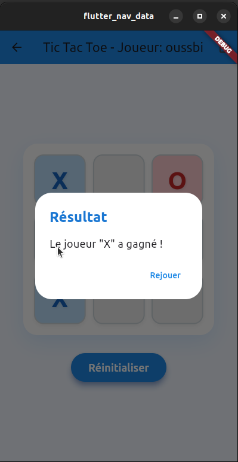
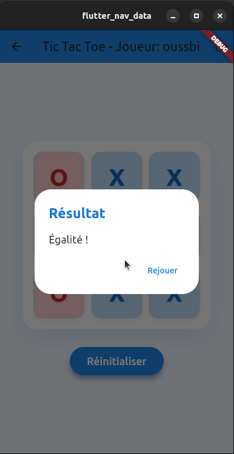

# 🎮 Tic Tac Toe Flutter App avec Authentification

Ce dépôt contient une **application mobile Flutter** pour jouer au jeu du **Tic Tac Toe** avec un système simple d’**authentification** et gestion de session.  
L’application propose une interface utilisateur fluide, un système de sauvegarde des comptes via `SharedPreferences`, ainsi que la gestion des parties et affichage des résultats (victoire, égalité).
Ce projet a été réalisé dans le cadre du module de **Développement Mobile Multiplatforme** encadré par **Mr JAMAL MAWANE**.
---

## 🎯 Objectifs du projet

- 🔐 Gérer l’authentification utilisateur (inscription, connexion, déconnexion)
- 🎮 Implémenter un jeu Tic Tac Toe interactif avec état dynamique
- 📱 Offrir une UI claire, responsive et agréable avec Material Design
- 🧩 Gérer les parties, détection du gagnant et égalité, avec possibilité de rejouer

---

## 📂 Structure du projet Flutter

```
lib/
├── main.dart
├── screen/
    ├──login.screen.dart
    ├── signup.screen.dart
    └── tictactoe.screen.dart
```


---

## 🛠️ Technologies utilisées

- **Flutter** & **Dart**  
- **SharedPreferences** pour la gestion locale des comptes  
- **Material Design** pour l’interface utilisateur

---

## ✅ Fonctionnalités principales

- 🔐 **Authentification** (inscription + connexion) avec données locales  
- 🎲 **Jeu Tic Tac Toe** avec gestion de tour et détection automatique de la victoire ou égalité  
- 🔄 **Réinitialisation** et possibilité de rejouer après chaque partie  
- 🚪 **Déconnexion** avec retour à l’écran de login  
- 🎨 UI simple et ergonomique avec Material Design  

---

## ⏵ Guide d’utilisation

### 🔐 Identifiants

- Inscrivez-vous avec un nom d’utilisateur et un mot de passe via l’écran d’inscription.  
- Utilisez ces identifiants pour vous connecter à l’app.  
- La session est sauvegardée localement.

### 🎮 Jouer au Tic Tac Toe

- Après connexion, lancez une partie de Tic Tac Toe.  
- Touchez une case vide pour jouer votre coup.  
- Le jeu détecte automatiquement les victoires ou égalités et affiche un dialogue.  
- Vous pouvez rejouer autant de fois que souhaité.

### 🚪 Déconnexion

- Utilisez le bouton logout dans la barre d’app pour revenir à l’écran de connexion.

---

## ▶️ Instructions d’exécution

1. Clone the repo  
   ```bash
   git clone https://github.com/ouss-issib/Tic-Tac-Toe-Game.git
   cd Tic-Tac-Toe-Game
   ```

2. Install dependencies  
   ```bash
   flutter pub get
   ```

3. Run the app  
   ```bash
   flutter run
   ```

## 📸 Captures d’écran

| Login Screen | Create Account | Signup Screen | Notification |
|--------------|--------------|--------------|--------------|
|  |  |  |  |

| Home Screen | Game Start | Player X Wins | Draw (Égalité) |
|-------------|------------|-------------|----------------|
|  |  |  |  |

